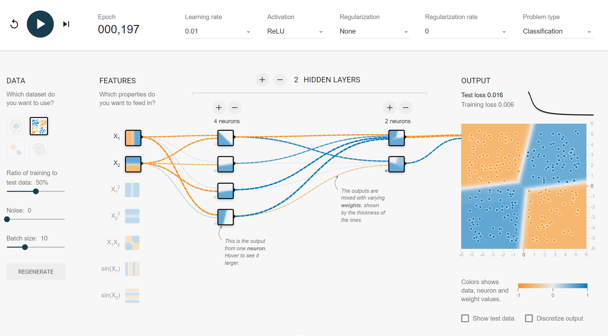

# Praca Domowa 1

Indywidualnie, zaimplementować model sieci neuronowej (MLP) do klasyfikacji w `torch` i przetestować go na dwóch zbiorach danych: XOR (wygenerować), oraz iris (pobrać). Powstały raport w formatach `.ipynb` oraz `.html` powinien zawierać wnioski z przeprowadzonej analizy.
1. do 2 punktów uzyskuje się za skuteczność klasyfikacji modeli i wizualizację procesu uczenia,
2. do 2 punktów uzyskuje się za analizę porównawczą różnych architektur sieci neuronowych (liczby neuronów i warstw),
3. 1 punkt uzyskuje się za analizę porównawczą różnych wartości `learning_rate`,
4. 1 punkt uzyskuje się za wytrenowanie skutecznego modelu na zbiorze danych MNIST i analizę macierzy pomyłek tej klasyfikacji,
5. 1 punkt uzyskuje się za ewaluowanie powyższych zjawisk na podzbiorze treningowym i testowym (analizę zjawiska przeuczenia),
6. 1 punkt uzyskuje się za animację zmiany granic decyzyjnych klasyfikacji podczas uczenia (na wybranym zbiorze danych),
7. do 2 punktów uzyskuje sie za jakość raportu (opisu, wizualizacji, kodu).

**Uwaga!** Warto zacząć od uczenia bardzo małych sieci i stopniowo zwiększać ich skomplikowanie.

Praca domowa jest na 8 punktów (można uzyskać max 10 punktów).

Deadline: 16 marca 23:59. Na zajęciach 17 marca 5 wybranch osób krótko zaprezentuje swoje wyniki.

Pracę zgłaszamy poprzez PR o tytule `[PD1] Imię Nazwisko` do folderu `homeworks/pd1/imię_nazwisko`.

# Przykład zbioru danych XOR

